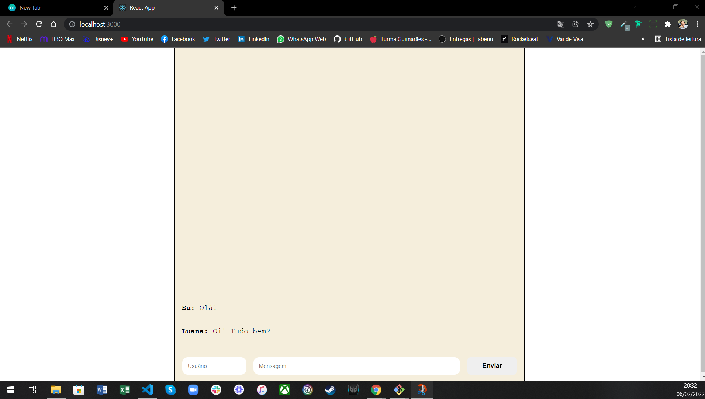

# Projeto de Fixação: WhatsLab

## Olá Terráqueos! 🖖👽

Este é um Projeto de Fixação do curso Web Full Stack da Labenu.

## 💬 Sobre o projeto:

O Whatslab é um aplicativo de troca de mensagens tal como o WhatsApp, Telegram, Messenger e muitos outros, porém neste projeto não foi desenvolvido um sistema que envia e recebe mensagens de fora, é algo simples que apenas mostra novas mensagens. 

## 👩‍💻 Linguagens Usadas:

* CSS;

* HTML;

* JAVASCRIPT.

## 📚 Bibliotecas Usadas:

* ReactJS;

## 🔗 Link do Surge: 

## O que funciona?

* Botão de Enviar Msg;
* Caixa de Texto;
* Caixa de Usuário.

## O que precisa adcionar?

* Enviar as mensagens ao teclar Enter;
* Apagar as mgs;
* Adicionar e posicionar o balão das mensagens.

## 📷 Layout Desktop 

